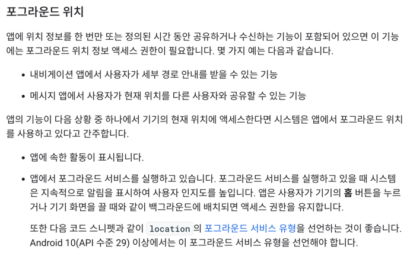
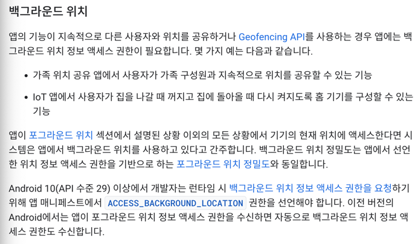
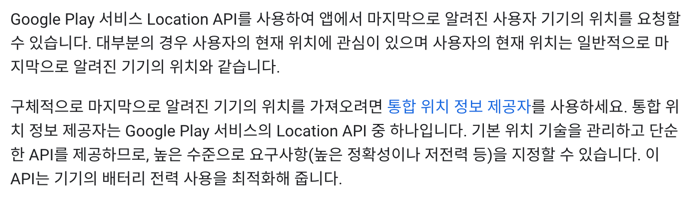
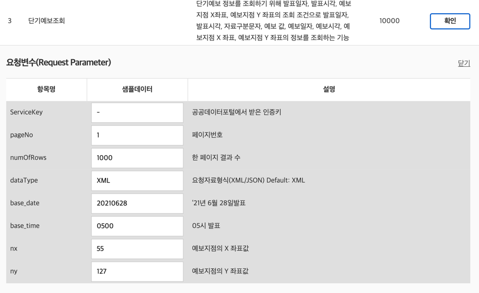

# WeatherWise

WeatherWise(날씨앱)- Location, Foreground Service, Android Widget, 공공데이터

## Location

백그라운드에서 로케이션을 가져올 수 있지만, 큰 제약이 있기 때문에 Foreground Service를 사용하도록 한다.

### 대략적인 위치 vs 정확한 위치

- 대략적인 위치
  - `ACCESS_COARSE_LOCATION` 권한
  - 런타임 권한
  - 오차범위: 3km 이내
  - 정확한 위치가 필요 없는 경우 사용(날씨앱)
- 정확한 위치
  - `ACCESS_FINE_LOCATION` 권한
  - 런타임 권한
  - 오차범위: 50m 이내
  - Android 12 (API 31) 이후부터 targetSDK가 31 이상인 경우 두 권한을 동시에 요청해야 함

### Foreground 위치 vs Background 위치


```xml
<!-- Recommended for Android 9 (API level 28) and lower. -->
<!-- Required for Android 10 (API level 29) and higher. -->
<service
    android:name="MyNavigationService"
    android:foregroundServiceType="location">
    <!-- Any inner elements would go here. -->
</service>
```
만일 포그라운드 서비스를 사용한다면 `android:foregroundServiceType="location"`을 명시해야 한다.



## Foreground Service

- Foreground 서비스는 안드로이드 애플리케이션에서 백그라운드에서 실행되면서 사용자에게 계속해서 중요한 작업을 수행하고 있는 것을 알리는 서비스이다.
- Forground 서비스는 계속 진행되는 작업이 중요하며 사용작의 직접적인 인터랙션이 필요하지 않은 경우에 사용된다. 예를 들어 음악 플레이어, GPS 추적, 파일 다운로드
  등의 작업이 이에 해당된다.

## 마지막으로 알려진 위치 가져오기




## Widget

https://developer.android.com/guide/topics/appwidgets/overview?hl=ko

날씨앱을 만들면서 사용할 위젯 유형은 `정보 위젯`이므로 다음의 요소들을 고려한다.

- 정보 위젯은 일반적으로 사용자에게 중요한 정보 요소를 표시하고 시간에 따른 정보의 변화를 추적
- 날씨 위젯, 시계 위젯 또는 스포츠 경기 점수 트래커가 주된 예시
- 일반적으로 **정보 위젯을 터치하면 연결된 앱이 실행**되고 위젯 정보의 세부정보 뷰가 열린다.

### 필요한 것들

- `AppWidgetProviderInfo` 객체
    - 앱 위젯의 레이아웃, 업데이트 빈도, AppWidgetProvider 클래스 등 앱 위젯의 메타데이터를 설명한다. XML로 정의해야 한다.
- `AppWidgetProvider` 클래스 구현
    - 브로드캐스트 이벤트를 기반으로 앱 위젯과 프로그래매틱 방식으로 접속할 수 있는 기본적인 방법을 정의한다.
    - 이를 통해 앱 위젯이 업데이트, 사용 설정, 사용 중지, 삭제될 때 브로드캐스트를 수신하게 된다.
- 레이아웃 보기
    - XML로 정의된 앱 위젯의 초기 레이아웃을 정의한다.
- manifest에서 앱 위젯 선언

```xml

<receiver android:name="ExampleAppWidgetProvider">
    <intent-filter>
        <action android:name="android.appwidget.action.APPWIDGET_UPDATE" />
    </intent-filter>
    <meta-data android:name="android.appwidget.provider"
        android:resource="@xml/example_appwidget_info" />
</receiver>
```

- AppWidgetProviderInfo 메타데이터 추가

이 외에도 추가적으로 설정할 것들은 공식 문서를 참고한다.

https://developer.android.com/guide/topics/appwidgets?hl=ko

## 공공 데이터 포털

- data.go.kr
- 기상청에서 제공하는 단기예보조회 API를 활동한다.
- 자세한 정보는 명세서를 참고한다.

https://www.data.go.kr/data/15084084/openapi.do



